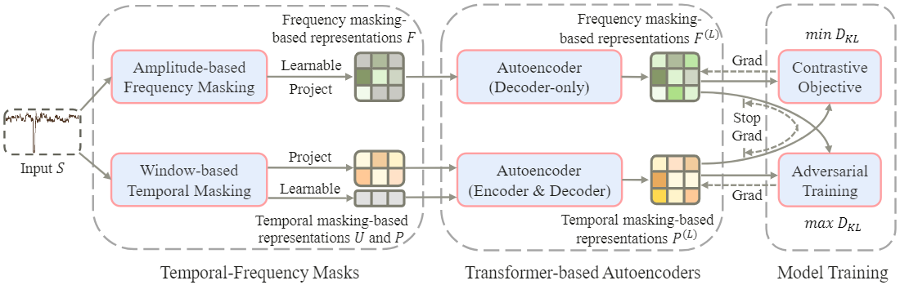
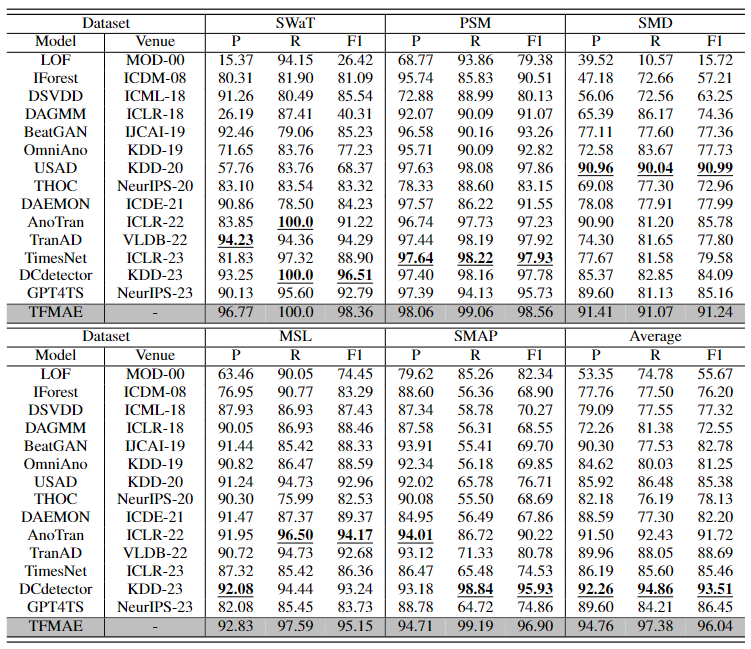
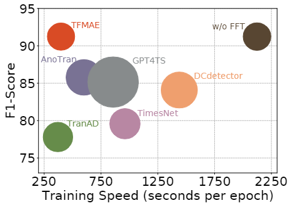

# TFMAE (Paper ID: 1225)

**Temporal-Frequency Masked Autoencoders for Time Series Anomaly Detection**


The most fundamental challenge for time series anomaly detection is to to identify observations that differ significantly from the remaining observations. Reconstruction-based methods still dominate, but the representation learning with anomalies bias and distribution shifts might hurt the performance. In this paper, we propose temporal-frequency masked autoencoders (TFMAE), a unsupervised time series anomaly detection model.

- **Overall**: Overall architecture of the proposed TFMAE. The left part contains temporal-frequency masks, the middle part is transformer-based autoencoders, and the right part shows our objective functions. $D_{KL}$ means the Kullback–Leibler divergence.

||
|:--:| 
| *Figure 1. The workflow of the TFMAE framework.* |


## Main Result
We compare our model with 14 baselines based on various metrics. Extensive experiments show that TFMAE achieves the best performance on five benchmark datasets compared to state-of-the-arts.

||
|:--:| 
| *Table 1. Overall results on real-world datasets.* |

||
|:--:|
| *Figure 2. Performance metrics are compared on the SMD dataset, with F1-Score represented in $\%$ on the $y$-axis, speed on the $x$-axis, and memory footprint indicated by the size of the circles for each method.* |


## Code Description
There are nine files/folders in the source.

- main.py: The main python file.
- solver.py: Another python file. The training, validation, and testing processing are all in there.
- config: Configuration folder. You can adjustment all parameters in there.
- cpt: Model weights folder. You can test performance through trained weight files.
- data_factory: The preprocessing folder/file. All datasets preprocessing codes are here.
- dataset: The dataset folder, and you can unzip these files.
- model: TFMAE model folder. The details can be corresponding to paper’s Section Section IV.
- pics: Images needed in readme.md.
- result: In our code demo, we can automatically save the results and hyper-parameters in this folder.


## Get Start
1. Install Python 3.x, PyTorch >= 1.12.
2. Unzip data in the dataset folder. All the datasets are well pre-processed.
3. Train and evaluate. You can reproduce the experiment results as follows:

```base
python main.py --config config/MSL.conf
python main.py --config config/PSM.conf
python main.py --config config/SMD.conf
python main.py --config config/SMAP.conf
python main.py --config config/SWaT.conf
```